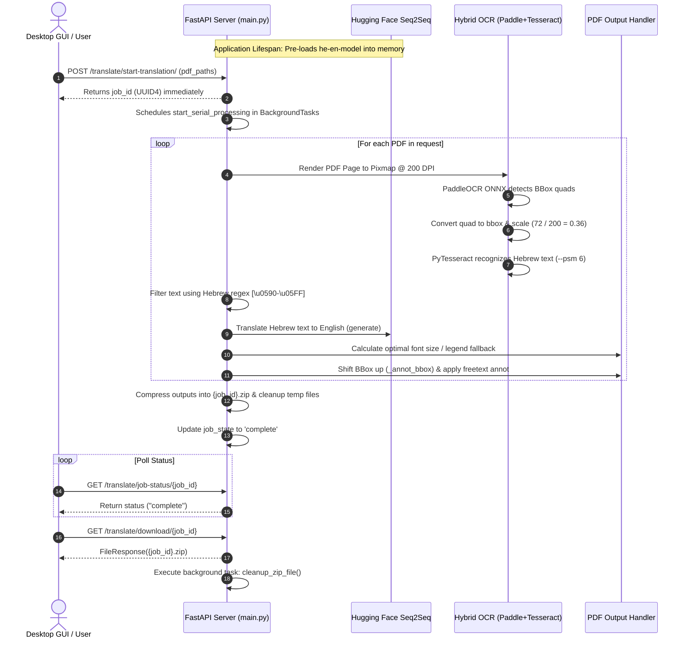

# Hebrew CAD PDF Translation Tool — Technical Architecture & Documentation

An end-to-end, high-performance desktop and REST API application designed to extract, translate, and re-annotate Hebrew text in complex CAD PDF drawings into English while retaining spatial context and document layout.

---

## 🛠 Project Prerequisites & Setup

### 1. Model Weights Download
 Download the fine-tuned Seq2Seq Hebrew-to-English machine translation model folder:
* **Download Link**: [Google Drive - he-en-model](https://drive.google.com/drive/folders/1EmCM96pY9Uh-9925LaLB48BLZT3jGu13?usp=sharing)
* **Destination**: Extract and save the entire folder in the project root directory under the exact name: `he-en-model/`

### 2. Environment Setup & Execution
Run the following commands in sequence within your terminal:

```bash
# 1. Create a virtual environment
python -m venv venv

# 2. Activate virtual environment (Windows PowerShell)
.\venv\Scripts\Activate.ps1

# 3. Install required dependencies
pip install -r requirements.txt

# 4. Launch the application (Starts Uvicorn server in background + CustomTkinter GUI)
python run_app.py
```

---

## 📁 System Architecture & Directory Overview

```
Hebrew-CAD-Translation-Tool/
│
├── run_app.py                 # Main entry point spawning FastAPI backend & CustomTkinter GUI
├── startup.py                 # Pre-flight environment check script
├── he-en-model/               # Hugging Face Seq2Seq translation model weights & tokenizer
├── poppler_bin/               # Binary dependencies for PDF image rendering
├── tesseract/                 # Tesseract OCR engine binaries with Hebrew language pack
├── ppocrv5_onnx/
│   └── run_ocr.py             # Hybrid OCR module (PaddleOCR detector + PyTesseract engine)
│
├── backend/                   # FastAPI Backend Service
│   ├── main.py                # App setup, CORS configuration, and lifespan startup event
│   ├── api/
│   │   └── translations.py    # REST Endpoints (/start-translation, /job-status, /download)
│   ├── core/
│   │   └── job_state.py       # In-memory thread-safe state store for asynchronous job tracking
│   ├── model/
│   │   └── model.py           # PyInstaller-aware ML model loader for Transformers model
│   ├── services/
│   │   └── pdf_translator.py  # Orchestrator for extraction, translation, and PDF rendering
│   └── utils/
│       ├── text_extraction.py # PDF rendering, OCR orchestration, table & Hebrew regex filtering
│       ├── translation.py     # Batch Seq2Seq translation execution
│       ├── output_pdf_handler.py # BBox math, font scaling, annotation overlays & layout composition
│       ├── legends_util.py    # Abbreviation refinement & legend page generation utilities
│       └── zip_and_queue_handler.py # Serial execution runner, ZIP compression & cleanup handlers
│
└── frontend/
    └── gui.py                 # CustomTkinter Desktop UI communicating with backend endpoints
```

---

## 🔑 Deep-Dive Technical Modules & Implementation Details

### 1. Lifespan Event of Translation Model

To avoid cold-start latency when users submit translation tasks, the machine learning model is loaded into GPU/CPU memory during FastAPI application initialization before accepting any HTTP requests.

* **Lifespan Context Manager** ([backend/main.py](file:///d:/Projects-nd-all/Personal%20Projects/PDF%20Translation%20Tool/Hebrew-translation-app/Hebrew-CAD-Translation-Tool/backend/main.py#L22-L35)):
  ```python
  @asynccontextmanager
  async def lifespan(app: FastAPI):
      try:
          logger.info("Server starting up: Setting up the translation model...")
          load_model()
          logger.info("Model loaded successfully. Server is ready")
      except Exception as e:
          logger.critical("FATAL: Failed to load translation model...", exc_info=True)
          raise RuntimeError("Failed to load the translation model.") from e
      yield
      logger.info("Shutting down the server")
  ```

* **Environment-Aware Model Loading** ([backend/model/model.py](file:///d:/Projects-nd-all/Personal%20Projects/PDF%20Translation%20Tool/Hebrew-translation-app/Hebrew-CAD-Translation-Tool/backend/model/model.py#L15-L41)):
  The `load_model()` function checks `sys.frozen` and `sys._MEIPASS` to resolve paths seamlessly whether running in standard Python development mode or as a compiled PyInstaller standalone executable (`.exe`):
  ```python
  if getattr(sys, 'frozen', False) and hasattr(sys, '_MEIPASS'):
      base_path = sys._MEIPASS
      local_model_path = os.path.join(base_path, "he-en-model")
  else:
      base_path = os.path.dirname(os.path.abspath(__file__))
      local_model_path = os.path.join(base_path, "..", "..", "he-en-model")

  tokenizer = AutoTokenizer.from_pretrained(local_model_path)
  model = AutoModelForSeq2SeqLM.from_pretrained(local_model_path)
  ```
  If model loading fails, a `RuntimeError` terminates backend startup immediately, preventing undefined runtime errors during request handling.

---

### 2. Job Status and Async Queue Management

PDF translation tasks are compute-heavy. The backend utilizes FastAPI's `BackgroundTasks` along with an in-memory job state store to process tasks asynchronously without blocking API responses.

* **In-Memory Job Registry** ([backend/core/job_state.py](file:///d:/Projects-nd-all/Personal%20Projects/PDF%20Translation%20Tool/Hebrew-translation-app/Hebrew-CAD-Translation-Tool/backend/core/job_state.py)):
  ```python
  jobs: Dict[str, Dict[str, Any]] = {}
  ```
  Job objects track state: `{"status": str, "result_path": Optional[str], "error": Optional[str]}`.

* **Lifecycle State Transitions**:
  1. `starting`: Client posts file paths to `/translate/start-translation/`. A unique `job_id` (UUID4) is returned instantly while `start_serial_processing` runs in the background.
  2. `extracting`: Set inside [backend/services/pdf_translator.py](file:///d:/Projects-nd-all/Personal%20Projects/PDF%20Translation%20Tool/Hebrew-translation-app/Hebrew-CAD-Translation-Tool/backend/services/pdf_translator.py#L28) prior to running OCR page rendering.
  3. `translating`: Updated right before executing Seq2Seq model batch inference.
  4. `creating_pdf`: Updated during fitz document reconstruction and freetext annotation placement.
  5. `complete`: Updated by `set_job_result()` once all processed PDFs are bundled into `{job_id}.zip`.
  6. `error`: Captured in `except` blocks and stored with trace error strings.

* **Serial Processing & ZIP Packaging** ([backend/utils/zip_and_queue_handler.py](file:///d:/Projects-nd-all/Personal%20Projects/PDF%20Translation%20Tool/Hebrew-translation-app/Hebrew-CAD-Translation-Tool/backend/utils/zip_and_queue_handler.py#L12-L66)):
  `start_serial_processing()` processes multiple uploaded PDFs sequentially, collects output path references, compresses them into a root ZIP archive, and deletes intermediate translated PDF files inside its `finally` block.

* **Streamed Download & post-response cleanup** ([backend/api/translations.py](file:///d:/Projects-nd-all/Personal%20Projects/PDF%20Translation%20Tool/Hebrew-translation-app/Hebrew-CAD-Translation-Tool/backend/api/translations.py#L63-L87)):
  When downloading the result from `GET /translate/download/{job_id}`, FastAPI serves the zip file via `FileResponse` and registers `cleanup_zip_file()` as a background task to delete the zip file automatically after the client stream finishes downloading.

---

### 3. Dual-Engine Hybrid OCR & Bounding Box Coordinate System

CAD PDF drawings contain text embedded inside arbitrary geometric vector paths or embedded raster images. Standard PDF text extraction often fails or returns broken reading orders. To overcome this, a **hybrid "Frankenstein" OCR pipeline** combining PaddleOCR ONNX and PyTesseract is used.

#### The Pipeline Steps ([ppocrv5_onnx/run_ocr.py](file:///d:/Projects-nd-all/Personal%20Projects/PDF%20Translation%20Tool/Hebrew-translation-app/Hebrew-CAD-Translation-Tool/ppocrv5_onnx/run_ocr.py)):

1. **Page Rasterization** ([backend/utils/text_extraction.py](file:///d:/Projects-nd-all/Personal%20Projects/PDF%20Translation%20Tool/Hebrew-translation-app/Hebrew-CAD-Translation-Tool/backend/utils/text_extraction.py#L55)):
   PyMuPDF converts each PDF page to a high-resolution PNG pixmap at **200 DPI**:
   ```python
   page_image = page.get_pixmap(dpi=200, alpha=False)
   ```

2. **Text Detection (PaddleOCR ONNX)**:
   PaddleOCR detector is executed (`det=True, rec=False`) to detect arbitrary oriented polygon bounding boxes (`quad` points):
   ```python
   results = run_ocr(str(img_path), det=True, rec=False, detector=detector)
   ```

3. **Quadrilateral to Rectangular BBox Conversion**:
   `_quad_to_box(quad)` calculates the minimal bounding rectangle covering the 4 quad vertices:
   ```python
   def _quad_to_box(quad):
       xs = quad[:, 0]
       ys = quad[:, 1]
       return int(xs.min()), int(ys.min()), int(xs.max()), int(ys.max())
   ```

4. **Text Recognition (PyTesseract)**:
   The PIL image is cropped to `text_crop = img.crop(bbox)`. Tesseract OCR is executed strictly on the cropped text block using `--psm 6` and `lang="heb+eng"`, achieving significantly higher Hebrew character recognition accuracy than generic OCR engines:
   ```python
   raw_text = pytesseract.image_to_string(text_crop, lang="heb+eng", config="--psm 6").strip()
   ```

5. **Coordinate System Transformation (DPI Adjustment Math)**:
   * PaddleOCR detects coordinates in **Pixel Space** at **200 DPI**.
   * PyMuPDF (`fitz`) PDF document layouts operate in **Point Space** at **72 DPI** ($1 \text{ inch} = 72 \text{ points}$).
   * To convert bounding box coordinates from pixel coordinates to PDF point coordinates:
     $$\text{Scaling Factor} = \frac{72 \text{ points/inch}}{200 \text{ pixels/inch}} = 0.36$$
   * Code implementation in `run_ocr_on_page`:
     ```python
     scaling_factor = 72 / 200
     scaled_bbox = tuple(scaling_factor * coord for coord in bbox)
     ```

---

### 4. Text Filtering, Preprocessing, and Neural Translation

#### Hebrew Text Filtering ([backend/utils/text_extraction.py](file:///d:/Projects-nd-all/Personal%20Projects/PDF%20Translation%20Tool/Hebrew-translation-app/Hebrew-CAD-Translation-Tool/backend/utils/text_extraction.py#L76-L94)):
Extracted text contains numbers, symbols, English dimensions, or CAD metadata. Filtering ensures only strings containing Hebrew characters are sent to the neural machine translation model using Unicode range checking (`\u0590` to `\u05FF`):
```python
def _is_likely_hebrew(text):
    hebrew_chars = re.findall(r'[\u0590-\u05FF]', text)
    return len(hebrew_chars) > 0
```

#### Seq2Seq Batch Translation ([backend/utils/translation.py](file:///d:/Projects-nd-all/Personal%20Projects/PDF%20Translation%20Tool/Hebrew-translation-app/Hebrew-CAD-Translation-Tool/backend/utils/translation.py#L9-L33)):
Extracted Hebrew strings are processed through the loaded PyTorch Hugging Face model:
```python
input_ids = translation_model.tokenizer(hebrew_text, return_tensors="pt").input_ids
translated_ids = translation_model.model.generate(input_ids, max_length=512)
english_text = translation_model.tokenizer.decode(translated_ids[0], skip_special_tokens=True).strip()
```

#### Bounding Box Fitting & Abbreviation Heuristics ([backend/utils/output_pdf_handler.py](file:///d:/Projects-nd-all/Personal%20Projects/PDF%20Translation%20Tool/Hebrew-translation-app/Hebrew-CAD-Translation-Tool/backend/utils/output_pdf_handler.py#L10-L63)):
Hebrew words are typically shorter in length than English translations. `get_optimal_fontsize()` computes whether the target translated string can fit into the destination bounding box rectangle considering both width and height:
```python
width_optimal_size = rect.width / text_len_at_size_1
height_optimal_size = rect.height / line_height_factor
optimal_size = min(width_optimal_size, height_optimal_size)
```
If `optimal_size < 4pt`, the text is too long for the drawing region. The system invokes `refine_abbreviation()` from `legends_util.py` to generate a short reference code (e.g. `[T1]`), which is logged into a legend panel dictionary.

---

### 5. Final Output Document Creation & Overlay Assembly

The original PDF vector layout is preserved while superimposing translated English text cleanly over the original document drawings ([backend/utils/output_pdf_handler.py](file:///d:/Projects-nd-all/Personal%20Projects/PDF%20Translation%20Tool/Hebrew-translation-app/Hebrew-CAD-Translation-Tool/backend/utils/output_pdf_handler.py#L67-L130)).

1. **Background Image Rasterization**:
   For each page in the source document, `create_translated_doc_in_memory()` creates a new page in a fresh `fitz.Document()`, renders the original page pixmap at 200 DPI, and places it as the background image.

2. **Vertical BBox Annotation Adjustment**:
   Overlaying text directly on top of the original bbox can obscure line geometries in CAD files. `_annot_bbox()` shifts the annotation box upward by half of its height:
   $$\text{Height } (y_{diff}) = y_1 - y_0$$
   $$\text{New Box} = \left( x_0, \; y_0 - 0.5 \cdot y_{diff}, \; x_1, \; y_1 - y_{diff} \right)$$
   ```python
   def _annot_bbox(bbox):
       x_diff = bbox[2] - bbox[0]
       y_diff = bbox[3] - bbox[1]
       return bbox[0], bbox[1] - (0.5 * y_diff), bbox[2], bbox[3] - y_diff
   ```

3. **Freetext Annotation Overlay**:
   Translated text is inserted onto the page using PyMuPDF freetext annotations in bright orange (`RGB: 1, 0.4, 0`):
   ```python
   output_page.add_freetext_annot(annot_box, display_text, text_color=(1, 0.4, 0), fontsize=6)
   ```

4. **Multi-Page Side-by-Side Legend Stitching (`assemble_final_pdf`)**:
   When legends are present, `assemble_final_pdf()` constructs a combined canvas where the translated PDF page is placed on the left, and the synthesized legend document is rendered side-by-side on the right:
   ```python
   new_width = t_rect.width + l_rect.width
   new_page = final_doc.new_page(width=new_width, height=new_height)
   new_page.show_pdf_page(fitz.Rect(0, 0, t_rect.width, t_rect.height), translated_doc, i)
   new_page.show_pdf_page(fitz.Rect(t_rect.width, 0, t_rect.width + l_rect.width, l_rect.height), legend_doc, 0)
   ```

---

## 🛠 Summary of Complete Execution Dataflow


